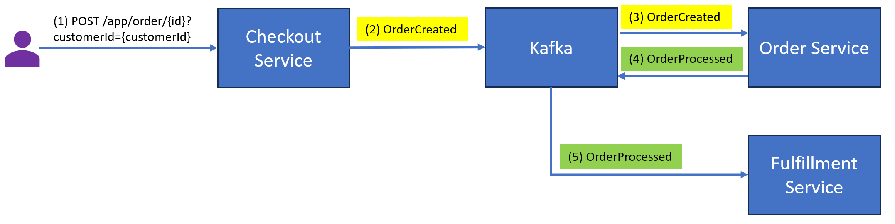

# Introduction

This project aims to demonstrate how Kafka works with Spring Cloud Stream in distributed systems with 
**Confluence Schema Registry** to manage schemas used in Apache Kafka-based data pipelines. 

This project simulates an Order Management system containing contains three services: **Checkout Service**, **Order Service** and **Fulfillment Service** communicating 
via two Kafka topics: **OrderCreated** and **OrderProcessed**. Each service can be scaled up horizontally by adding more instance. 
The order process is triggered via a REST API sent from the client side to Checkout Service as below.



When a new order is placed, we produce a message to Kafka with the order details and use the 
customer ID as the message key to ensures that all events related to the same customer (based on customer ID) 
are processed sequentially by assigning them to the same partition. We will create  **OrderCreated** and **OrderProcessed**
topic with two partitions to demo how this mechanism works.


## Tech stack

JDK 11, Gradle, Spring boot, Spring Cloud Stream, Kafka, Docker Compose

## How to get started?
We need to build up Kafka with a Zookeeper, a broker, a schema registry and two topics using docker-compose:
```shell
docker-compose up
```

We can start this project via below gradle commands:
```shell
gradle build
gradle bootRun
```
CURL to check out an order
```shell
curl --location --request POST 'localhost:8080/app/order/999?customerId=9'
```
We can also access to kafka ui via http://localhost:8088 which was created by docker-compose to obverse 
created messages, and the topic partition assigned to them.